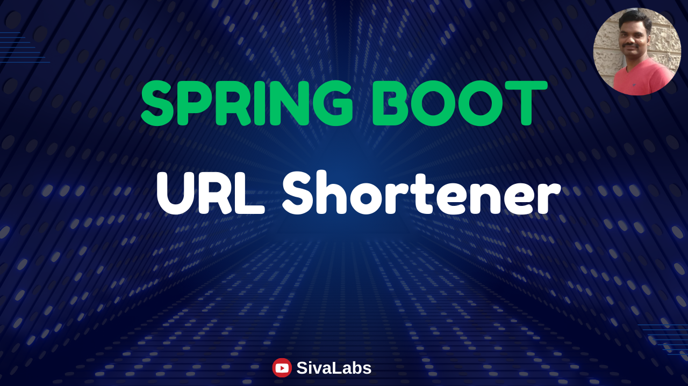

# Spring Boot URL Shortener
URL Shortener is a service that shortens a long URL into a short URL which is easier to share.

This repository contains the source code for the [Spring Boot URL Shortener Course](https://www.youtube.com/playlist?list=PLuNxlOYbv61gfJv1uTOFKAWig98e7fk_m).

## Requirements
1. Shorten URL:
    * Accept a long URL and return a shortened URL.
    * The shortened URL should be unique.
    * Validate the input URL for correctness (optional/configurable).
    * Allow guest users to create public shortened URLs with the default 30-day expiration.
    * Allow authenticated users:
        * Create public or private shortened URLs with custom expiration time.
        * View and delete their shortened URLs.

2. Redirection:
    * When a shortened URL is accessed, it should redirect to the original long URL.
    * Handle invalid or expired shortened URLs gracefully.

3. Analytics:
    * Track the number of clicks for each shortened URL.

4. User Management:
    * Allow users to register and login.
    * Admin users can view any shortened URLs(including public and private URLs).

